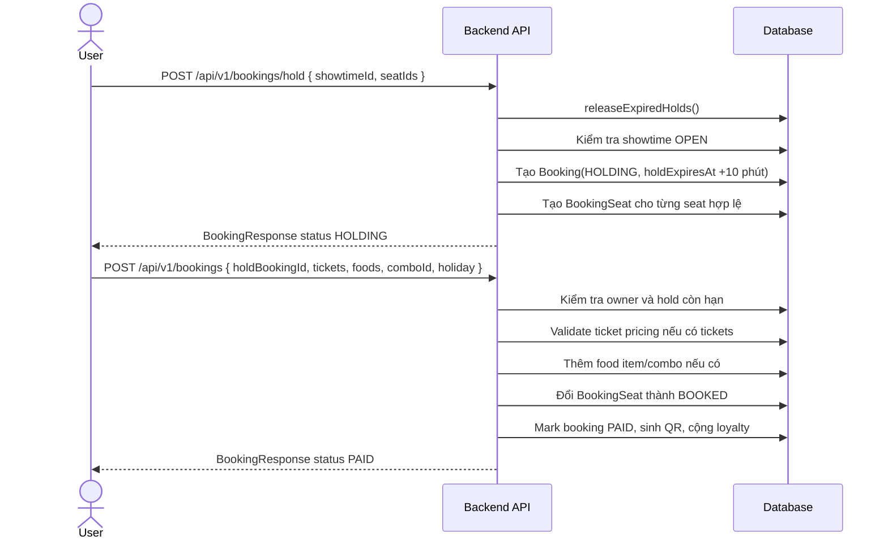
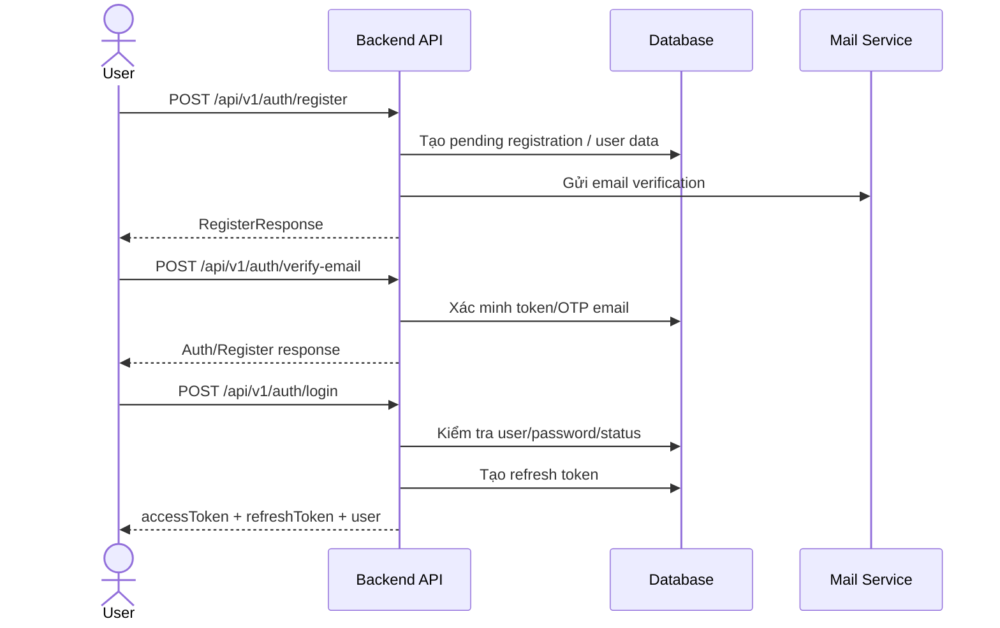
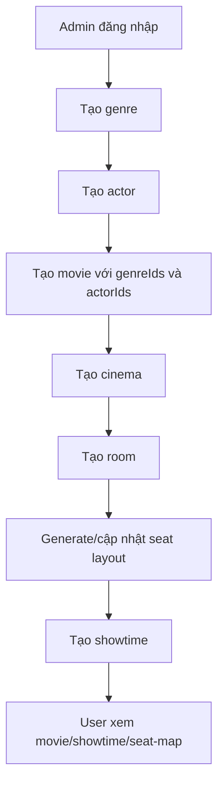
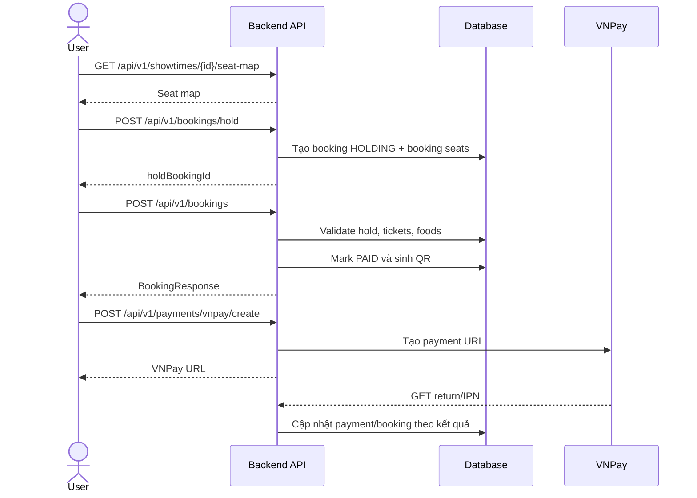
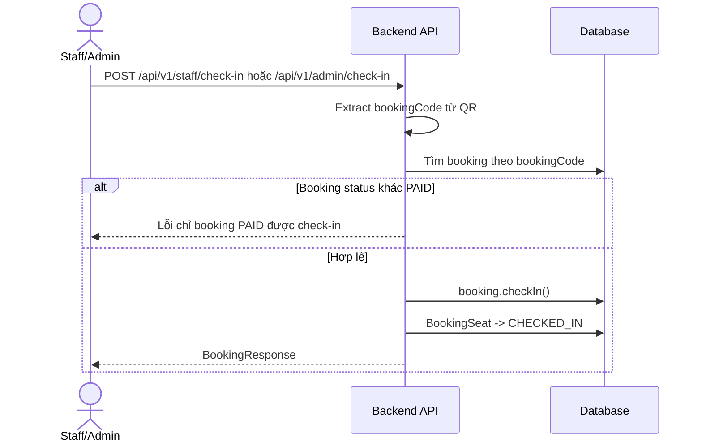
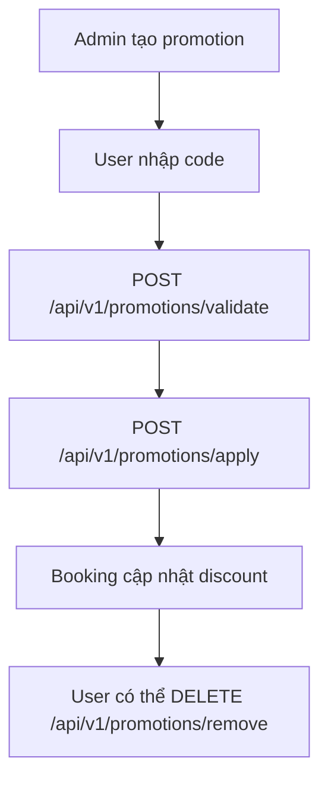
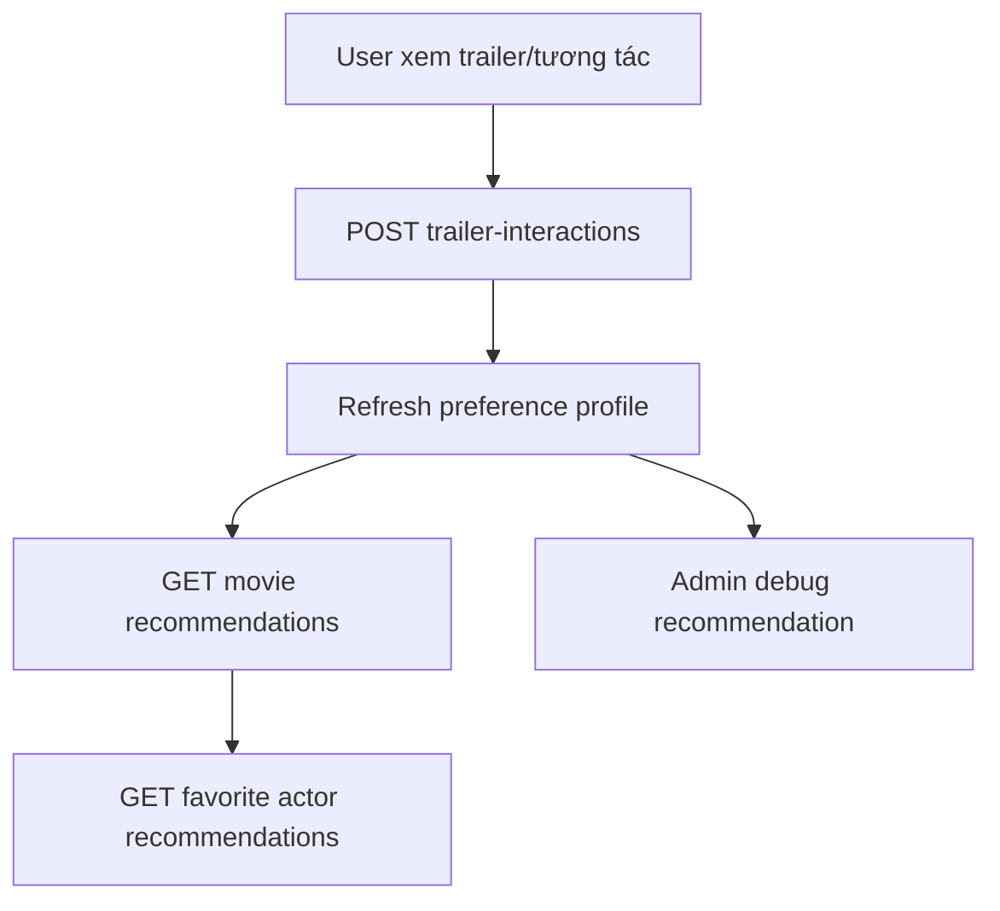

# CinemaAI - Thông tin và luồng nghiệp vụ đang có trong project

> Tài liệu này mô tả **những gì đang có trong project backend CinemaAI hiện tại**. Nội dung được tổng hợp từ source code, controller, service, entity, enum, migration và tài liệu API trong thư mục `api/`. Tài liệu chỉ tập trung vào các module và endpoint đang có trong project.

# 1. Giới thiệu

## 1.1 Mục đích tài liệu

Tài liệu này dùng để mô tả phạm vi, module, actor, API và luồng nghiệp vụ thực tế của project backend CinemaAI. Cách trình bày gần với SRS, nhưng nội dung chỉ dựa trên code hiện tại của project.

## 1.2 Phạm vi hệ thống hiện tại

Project hiện tại là backend API cho hệ thống mua bán vé xem phim, gồm các nhóm chức năng:

- Xác thực tài khoản, JWT, refresh token, Google login, email verification và reset password.
- Quản lý user profile, đổi mật khẩu, quản lý user cho admin.
- Quản lý phim, thể loại, diễn viên, trạng thái phim và upload ảnh.
- Quản lý rạp, phòng, hàng ghế, ghế, sơ đồ ghế và suất chiếu.
- Giá vé, combo vé, validate giá theo loại vé, tuổi người xem và ngày lễ.
- Giữ ghế, tạo booking, thêm đồ ăn/combo, sinh QR vé, lịch sử booking.
- Thanh toán VNPay, mock payment, return URL, IPN và xem payment theo booking.
- Check-in vé bằng QR cho staff/admin.
- Promotion, wishlist, loyalty point và notification nội bộ.
- AI analysis cho phim và recommendation cá nhân hóa.
- Tài liệu API theo phase trong thư mục `api/`.

## 1.3 Stack kỹ thuật

| Thành phần | Đang dùng trong project |
| --- | --- |
| Backend framework | Spring Boot |
| Data access | Spring Data JPA |
| Database chính | PostgreSQL |
| Migration | Flyway |
| Security | Spring Security, JWT |
| API docs | Springdoc OpenAPI / Swagger UI |
| Mail | Spring Mail |
| File upload | Cloudinary |
| Payment | VNPay |
| AI | Spring AI OpenAI, Gemini/OpenAI analysis strategy, mock strategy |
| Test | Spring Boot Test, H2, Spring Security Test |

# 2. Actor và role đang có

## 2.1 User / Customer

Người dùng đăng nhập và sử dụng các API public/authenticated để xem phim, xem rạp/suất chiếu, giữ ghế, tạo booking, thanh toán, xem booking, dùng wishlist, xem loyalty, xem notification và nhận recommendation.

## 2.2 Staff

Staff được hỗ trợ ở luồng check-in vé qua endpoint:

- `POST /api/v1/staff/check-in`

Project có entity `StaffProfile`, `StaffShift`, enum `StaffStatus`, nhưng API staff hiện tại tập trung vào check-in vé.

## 2.3 Admin

Admin quản lý dữ liệu hệ thống qua các API `/api/v1/admin/...`, gồm user, movie, genre, actor, cinema, room, showtime, ticket pricing, food, promotion, booking, upload, loyalty, recommendation debug và movie analysis.

# 3. Module chức năng đang có

## 3.1 Auth, user và security

### Chức năng

- Đăng ký tài khoản.
- Xác minh email bằng OTP/token.
- Gửi lại yêu cầu xác minh email.
- Đăng nhập bằng email/mật khẩu.
- Đăng nhập Google.
- Xác minh Google OTP.
- Refresh access token.
- Logout.
- Yêu cầu reset password.
- Xác nhận reset password.
- Lấy profile user hiện tại.
- Cập nhật profile user hiện tại.
- Đổi mật khẩu.
- Admin xem danh sách user, xem chi tiết user, đổi status user.

### API chính

| Method | Endpoint | Mô tả |
| --- | --- | --- |
| POST | `/api/v1/auth/register` | Đăng ký tài khoản |
| POST | `/api/v1/auth/login` | Đăng nhập |
| POST | `/api/v1/auth/google` | Đăng nhập Google |
| POST | `/api/v1/auth/google/verify` | Xác minh Google |
| POST | `/api/v1/auth/refresh` | Refresh token |
| POST | `/api/v1/auth/logout` | Đăng xuất |
| POST | `/api/v1/auth/verify-email` | Xác minh email |
| POST | `/api/v1/auth/verify-email/request` | Gửi lại OTP/email verification |
| POST | `/api/v1/auth/password-reset/request` | Yêu cầu reset password |
| POST | `/api/v1/auth/password-reset/confirm` | Đặt lại password |
| GET | `/api/v1/users/me` | Lấy thông tin user đang đăng nhập |
| PUT | `/api/v1/users/me` | Cập nhật profile |
| POST | `/api/v1/users/me/password` | Đổi mật khẩu |
| GET | `/api/v1/admin/users` | Admin xem danh sách user |
| GET | `/api/v1/admin/users/{userId}` | Admin xem chi tiết user |
| PATCH | `/api/v1/admin/users/{userId}/status` | Admin cập nhật status user |

### Entity/lớp liên quan

- `User`, `UserProfile`, `Role`, `UserRole`
- `RefreshToken`, `PendingRegistration`
- `EmailVerificationToken`, `PasswordResetToken`
- `AuthService`, `UserService`, `RefreshTokenService`, `EmailVerificationService`, `PasswordResetService`, `GoogleTokenVerifier`
- `JwtService`, `JwtAuthenticationFilter`, `CustomUserDetailsService`

## 3.2 Movie, genre, actor và upload

### Chức năng

- User/public xem danh sách phim và chi tiết phim.
- Lọc/tìm phim theo keyword, genre và các filter được service hỗ trợ.
- User/public xem genre, actor và phim theo actor.
- Admin CRUD movie, genre, actor.
- Admin cập nhật status movie.
- Admin upload image qua Cloudinary.
- Movie có metadata: ngôn ngữ, subtitle, age rating, director, main actors, cast list.
- Movie có quan hệ nhiều-nhiều với genre và actor.

### API public

| Method | Endpoint | Mô tả |
| --- | --- | --- |
| GET | `/api/v1/movies` | Tìm/xem danh sách phim public |
| GET | `/api/v1/movies/{movieId}` | Xem chi tiết phim |
| GET | `/api/v1/genres` | Xem danh sách genre |
| GET | `/api/v1/genres/{genreId}` | Xem chi tiết genre |
| GET | `/api/v1/actors` | Xem/tìm actor |
| GET | `/api/v1/actors/{actorId}` | Xem chi tiết actor |
| GET | `/api/v1/actors/{actorId}/movies` | Xem phim theo actor |

### API admin

| Method | Endpoint | Mô tả |
| --- | --- | --- |
| GET | `/api/v1/admin/movies` | Admin tìm/xem danh sách phim |
| GET | `/api/v1/admin/movies/{movieId}` | Admin xem chi tiết phim |
| POST | `/api/v1/admin/movies` | Tạo phim |
| PUT | `/api/v1/admin/movies/{movieId}` | Cập nhật phim |
| PATCH | `/api/v1/admin/movies/{movieId}/status` | Đổi status phim |
| DELETE | `/api/v1/admin/movies/{movieId}` | Xóa phim |
| POST | `/api/v1/admin/genres` | Tạo genre |
| PUT | `/api/v1/admin/genres/{genreId}` | Cập nhật genre |
| DELETE | `/api/v1/admin/genres/{genreId}` | Xóa genre |
| GET | `/api/v1/admin/actors` | Admin tìm/xem actor |
| POST | `/api/v1/admin/actors` | Tạo actor |
| PUT | `/api/v1/admin/actors/{actorId}` | Cập nhật actor |
| DELETE | `/api/v1/admin/actors/{actorId}` | Xóa actor |
| POST | `/api/v1/admin/uploads/images` | Upload ảnh |

### Entity/lớp liên quan

- `Movie`, `Genre`, `Actor`, `MovieGenre`, `MovieActor`, `UploadedFile`
- `MovieStatus`, `AgeRating`, `UploadedFileStatus`
- `MovieService`, `GenreService`, `ActorService`, `CloudinaryUploadService`

## 3.3 Cinema, room, seat và showtime

### Chức năng

- User/public xem rạp, phòng trong rạp, suất chiếu và seat map theo suất chiếu.
- Admin CRUD cinema.
- Admin CRUD room.
- Admin tạo/cập nhật seat layout.
- Admin generate ghế theo layout.
- Admin cập nhật status room.
- Admin CRUD showtime.
- Admin tạo showtime hàng loạt.
- Showtime có seat map để user chọn ghế.

### API public

| Method | Endpoint | Mô tả |
| --- | --- | --- |
| GET | `/api/v1/cinema` | Xem danh sách cinema |
| GET | `/api/v1/cinemas` | Alias xem danh sách cinema |
| GET | `/api/v1/cinemas/{cinemaId}` | Xem chi tiết cinema |
| GET | `/api/v1/cinema/rooms` | Xem rooms |
| GET | `/api/v1/cinemas/{cinemaId}/rooms` | Xem rooms theo cinema |
| GET | `/api/v1/showtimes` | Tìm/xem danh sách showtime |
| GET | `/api/v1/showtimes/{showtimeId}` | Xem chi tiết showtime |
| GET | `/api/v1/showtimes/{showtimeId}/seat-map` | Xem seat map của showtime |

### API admin

| Method | Endpoint | Mô tả |
| --- | --- | --- |
| GET | `/api/v1/admin/cinema` | Admin xem cinema |
| POST | `/api/v1/admin/cinema` | Tạo cinema |
| PUT | `/api/v1/admin/cinema` | Cập nhật cinema |
| PATCH | `/api/v1/admin/cinema/status` | Đổi status cinema |
| DELETE | `/api/v1/admin/cinema` | Xóa cinema |
| GET | `/api/v1/admin/rooms` | Xem danh sách room |
| GET | `/api/v1/admin/rooms/{roomId}` | Xem chi tiết room |
| GET | `/api/v1/admin/rooms/{roomId}/seats` | Xem ghế trong room |
| GET | `/api/v1/admin/rooms/seats/{seatId}` | Xem chi tiết ghế |
| POST | `/api/v1/admin/rooms` | Tạo room |
| PUT | `/api/v1/admin/rooms/{roomId}` | Cập nhật room |
| PATCH | `/api/v1/admin/rooms/{roomId}/status` | Đổi status room |
| POST | `/api/v1/admin/rooms/{roomId}/seats/generate` | Generate ghế |
| PUT | `/api/v1/admin/rooms/{roomId}/seats` | Cập nhật seat layout |
| PUT | `/api/v1/admin/rooms/seats/{seatId}` | Cập nhật một ghế |
| DELETE | `/api/v1/admin/rooms/seats/{seatId}` | Xóa ghế |
| GET | `/api/v1/admin/showtimes` | Admin tìm/xem showtime |
| GET | `/api/v1/admin/showtimes/{showtimeId}` | Admin xem chi tiết showtime |
| GET | `/api/v1/admin/showtimes/{showtimeId}/seat-map` | Admin xem seat map |
| POST | `/api/v1/admin/showtimes` | Tạo showtime |
| POST | `/api/v1/admin/showtimes/bulk` | Tạo showtime hàng loạt |
| PUT | `/api/v1/admin/showtimes/{showtimeId}` | Cập nhật showtime |
| PATCH | `/api/v1/admin/showtimes/{showtimeId}/status` | Đổi status showtime |
| DELETE | `/api/v1/admin/showtimes/{showtimeId}` | Xóa showtime |

### Entity/lớp liên quan

- `Cinema`, `Room`, `SeatRow`, `Seat`, `Showtime`
- `CinemaStatus`, `RoomStatus`, `RoomType`, `SeatStatus`, `SeatRuntimeStatus`, `SeatType`, `ShowtimeStatus`
- `CinemaService`, `RoomService`, `ShowtimeService`

## 3.4 Ticket pricing và ticket combo

### Chức năng

- User xem ticket combo và option vé.
- User validate giá vé theo showtime, combo, holiday và danh sách ticket selection.
- Admin quản lý ticket pricing rules.
- Admin quản lý ticket combos.
- Ticket pricing có kiểm tra độ tuổi theo ticket type và age rating của phim.

### API

| Method | Endpoint | Mô tả |
| --- | --- | --- |
| GET | `/api/v1/ticket-pricing/combos` | Xem combo vé public |
| GET | `/api/v1/ticket-pricing/options` | Xem option vé public |
| POST | `/api/v1/ticket-pricing/validate` | Validate/tính giá vé |
| GET | `/api/v1/admin/ticket-pricing/rules` | Admin xem pricing rules |
| POST | `/api/v1/admin/ticket-pricing/rules` | Tạo pricing rule |
| PUT | `/api/v1/admin/ticket-pricing/rules/{ruleId}` | Cập nhật pricing rule |
| DELETE | `/api/v1/admin/ticket-pricing/rules/{ruleId}` | Xóa pricing rule |
| GET | `/api/v1/admin/ticket-pricing/combos` | Admin xem ticket combos |
| POST | `/api/v1/admin/ticket-pricing/combos` | Tạo ticket combo |
| PUT | `/api/v1/admin/ticket-pricing/combos/{comboId}` | Cập nhật ticket combo |
| DELETE | `/api/v1/admin/ticket-pricing/combos/{comboId}` | Xóa ticket combo |

### Entity/lớp liên quan

- `TicketPricingRule`, `TicketCombo`, `BookingTicket`
- `TicketType`, `AgeRating`
- `TicketPricingService`

## 3.5 Food và food combo

### Chức năng

- User xem food items và food combos active.
- Booking có thể kèm food item hoặc food combo.
- Admin CRUD food item và food combo.
- Food/combo có ảnh, mô tả, giá và status.

### API

| Method | Endpoint | Mô tả |
| --- | --- | --- |
| GET | `/api/v1/foods/items` | User xem food items |
| GET | `/api/v1/foods/combos` | User xem food combos |
| GET | `/api/v1/admin/foods/items` | Admin xem food items |
| GET | `/api/v1/admin/foods/combos` | Admin xem food combos |
| POST | `/api/v1/admin/foods/items` | Tạo food item |
| POST | `/api/v1/admin/foods/combos` | Tạo food combo |
| PUT | `/api/v1/admin/foods/items/{itemId}` | Cập nhật food item |
| PUT | `/api/v1/admin/foods/combos/{comboId}` | Cập nhật food combo |
| DELETE | `/api/v1/admin/foods/items/{itemId}` | Xóa food item |
| DELETE | `/api/v1/admin/foods/combos/{comboId}` | Xóa food combo |

### Entity/lớp liên quan

- `FoodItem`, `FoodCombo`, `BookingFoodItem`
- `FoodItemStatus`
- `FoodService`

## 3.6 Booking, seat hold, QR ticket và refund request

### Chức năng

- User giữ ghế cho một showtime.
- Hệ thống tạo booking status `HOLDING` và `holdExpiresAt = now + 10 minutes`.
- Scheduler giải phóng booking/ghế hết hạn giữ.
- User tạo booking từ hold booking.
- Khi tạo booking có thể gửi tickets để validate giá vé và foods để thêm đồ ăn/combo.
- Sau khi booking thành công, booking được mark paid, sinh QR ticket và cộng loyalty point.
- User xem danh sách booking của mình.
- User xem chi tiết booking của mình.
- User hủy booking.
- User gửi refund request.
- Admin xem booking, check-in, hủy, request refund và mark refunded.
- Staff/admin check-in bằng QR code.

### API user/staff

| Method | Endpoint | Mô tả |
| --- | --- | --- |
| POST | `/api/v1/bookings/hold` | Giữ ghế |
| POST | `/api/v1/bookings` | Tạo booking từ hold |
| GET | `/api/v1/bookings` | Xem booking của user hiện tại |
| GET | `/api/v1/bookings/{bookingId}` | Xem chi tiết booking |
| DELETE | `/api/v1/bookings/{bookingId}` | Hủy booking |
| POST | `/api/v1/bookings/{bookingId}/refund-request` | User gửi yêu cầu refund |
| POST | `/api/v1/staff/check-in` | Staff check-in QR |

### API admin

| Method | Endpoint | Mô tả |
| --- | --- | --- |
| GET | `/api/v1/admin/bookings` | Admin xem danh sách booking |
| GET | `/api/v1/admin/bookings/{bookingId}` | Admin xem chi tiết booking |
| DELETE | `/api/v1/admin/bookings/{bookingId}` | Admin hủy booking |
| POST | `/api/v1/admin/bookings/{bookingId}/check-in` | Admin check-in booking |
| POST | `/api/v1/admin/bookings/{bookingId}/refund-request` | Admin tạo refund request |
| POST | `/api/v1/admin/bookings/{bookingId}/mark-refunded` | Admin mark refunded |
| POST | `/api/v1/admin/check-in` | Admin/staff alias check-in QR |

### Luồng giữ ghế và booking hiện tại

### Entity/lớp liên quan

- `Booking`, `BookingSeat`, `BookingTicket`, `BookingFoodItem`, `BookingPromotion`, `Payment`
- `BookingStatus`, `SeatRuntimeStatus`, `PaymentStatus`
- `BookingService`, `QrTicketService`, `SeatHoldCleanupScheduler`

## 3.7 Payment và VNPay

### Chức năng

- Tạo payment URL VNPay cho booking.
- Xử lý return URL VNPay.
- Xử lý VNPay IPN.
- Mock payment cho test.
- Xem payment theo booking.
- Payment có provider/status/amount/transaction reference.

### API

| Method | Endpoint | Mô tả |
| --- | --- | --- |
| POST | `/api/v1/payments/vnpay/create` | Tạo thanh toán VNPay |
| GET | `/api/v1/payments/vnpay/return` | Xử lý return từ VNPay |
| GET | `/api/v1/payments/vnpay/ipn` | Xử lý VNPay IPN |
| POST | `/api/v1/payments/mock` | Mock payment cho test |
| GET | `/api/v1/payments/booking/{bookingId}` | Xem payment theo booking |

### Entity/lớp liên quan

- `Payment`
- `PaymentProvider`, `PaymentStatus`
- `PaymentService`, `VNPayService`, `VNPayUtil`, `VnpayProperties`, `VNPayConfig`

## 3.8 Promotion

### Chức năng

- Admin CRUD promotion.
- User xem promotion theo code.
- User apply promotion vào booking.
- User remove promotion khỏi booking.
- User validate/preview promotion.
- Promotion có discount type, usage limit, used count và status.

### API

| Method | Endpoint | Mô tả |
| --- | --- | --- |
| GET | `/api/v1/promotions/{code}` | User/public xem promotion theo code |
| POST | `/api/v1/promotions/apply` | Apply promotion vào booking |
| DELETE | `/api/v1/promotions/remove` | Gỡ promotion khỏi booking |
| POST | `/api/v1/promotions/validate` | Validate/preview promotion |
| POST | `/api/v1/admin/promotions` | Tạo promotion |
| PUT | `/api/v1/admin/promotions/{id}` | Cập nhật promotion |
| DELETE | `/api/v1/admin/promotions/{id}` | Xóa promotion |
| GET | `/api/v1/admin/promotions` | Admin xem danh sách promotion |
| GET | `/api/v1/admin/promotions/{code}` | Admin xem promotion theo code |

### Entity/lớp liên quan

- `Promotion`, `BookingPromotion`
- `PromotionType`, `PromotionStatus`
- `PromotionService`

## 3.9 Wishlist

### Chức năng

- User thêm phim vào wishlist.
- User xem wishlist của mình.
- User xóa phim khỏi wishlist.

### API

| Method | Endpoint | Mô tả |
| --- | --- | --- |
| POST | `/api/v1/wishlist` | Thêm phim vào wishlist |
| GET | `/api/v1/wishlist` | Xem wishlist của user hiện tại |
| DELETE | `/api/v1/wishlist/{movieId}` | Xóa phim khỏi wishlist |

### Entity/lớp liên quan

- `Wishlist`
- `WishlistService`

## 3.10 Loyalty point

### Chức năng

- User xem điểm loyalty của mình.
- Hệ thống cộng điểm từ booking thành công.
- Admin cộng điểm cho user.
- Admin redeem/trừ điểm của user.

### API

| Method | Endpoint | Mô tả |
| --- | --- | --- |
| GET | `/api/v1/loyalty/me` | User xem loyalty của mình |
| POST | `/api/v1/admin/loyalty/add` | Admin cộng điểm |
| POST | `/api/v1/admin/loyalty/{userId}/redeem` | Admin redeem/trừ điểm |

### Entity/lớp liên quan

- `LoyaltyPoint`
- `LoyaltyPointType`, `LoyaltyStatus`, `LoyaltyTier`
- `LoyaltyPointService`

## 3.11 Notification

### Chức năng

- Admin tạo notification cho user.
- User xem tất cả notification của mình.
- User xem notification chưa đọc.
- User mark notification đã đọc.

### API

| Method | Endpoint | Mô tả |
| --- | --- | --- |
| POST | `/api/v1/notifications` | Admin tạo notification cho user |
| GET | `/api/v1/notifications/me` | User xem notification của mình |
| GET | `/api/v1/notifications/me/unread` | User xem notification chưa đọc |
| PATCH | `/api/v1/notifications/{id}/read` | Mark read |

### Entity/lớp liên quan

- `Notification`
- `NotificationType`
- `NotificationService`

## 3.12 Recommendation và trailer interaction

### Chức năng

- User ghi nhận trailer interaction.
- User refresh preference profile.
- User xem preference profile của mình.
- User xem recommendation phim.
- User xem favorite actor recommendations.
- Admin xem debug recommendation của user.
- Recommendation dùng nhiều signal như trailer interaction, booking, review, genre/actor/cohort.

### API

| Method | Endpoint | Mô tả |
| --- | --- | --- |
| POST | `/api/v1/recommendations/trailer-interactions` | Ghi nhận trailer interaction |
| POST | `/api/v1/recommendations/preferences/refresh` | Refresh preference của user |
| GET | `/api/v1/recommendations/preferences/me` | Xem preference của user |
| GET | `/api/v1/recommendations/movies` | Lấy movie recommendation |
| GET | `/api/v1/recommendations/favorite-actors` | Lấy favorite actor recommendation |
| GET | `/api/v1/admin/recommendations/users/{userId}/debug` | Admin debug recommendation |

### Entity/lớp liên quan

- `TrailerInteraction`, `UserPreferenceProfile`, `UserCohortPreference`, `Review`
- `TrailerInteractionType`, `PreferenceSignalType`
- `RecommendationService`, `RecommendationStrategy`, `MockRecommendationStrategy`

## 3.13 AI movie analysis

### Chức năng

- Admin tạo analysis cho movie.
- Admin xem analysis theo movie.
- Admin xem chi tiết analysis.
- Admin regenerate analysis.
- Admin approve/reject analysis.
- Admin xóa analysis.
- User/public xem analysis đã approve của movie.
- Có strategy OpenAI, Gemini và mock.

### API

| Method | Endpoint | Mô tả |
| --- | --- | --- |
| GET | `/api/v1/movies/{movieId}/analysis` | Xem analysis public của movie |
| POST | `/api/v1/admin/movies/{movieId}/analyses` | Tạo analysis |
| GET | `/api/v1/admin/movies/{movieId}/analyses` | Xem analysis theo movie |
| GET | `/api/v1/admin/analyses/{analysisId}` | Xem chi tiết analysis |
| POST | `/api/v1/admin/analyses/{analysisId}/regenerate` | Regenerate analysis |
| POST | `/api/v1/admin/analyses/{analysisId}/approve` | Approve analysis |
| POST | `/api/v1/admin/analyses/{analysisId}/reject` | Reject analysis |
| DELETE | `/api/v1/admin/analyses/{analysisId}` | Xóa analysis |

### Entity/lớp liên quan

- `AIAnalysis`, `AIEmotionSegment`
- `AIAnalysisStatus`, `EmotionType`, `ContentLabel`
- `AIAnalysisService`, `AIResultParser`, `PromptBuilder`, `OpenAIMovieAnalysisStrategy`, `GeminiMovieAnalysisStrategy`, `MockMovieAnalysisStrategy`

# 4. Dữ liệu/domain model hiện có

## 4.1 Nhóm user và security

- `users`
- `user_profiles`
- `roles`
- `user_roles`
- `refresh_tokens`
- `pending_registrations`
- `email_verification_tokens`
- `password_reset_tokens`
- `phone_verification_tokens` tồn tại ở entity/schema, nhưng project hiện tại không có controller riêng cho luồng này trong phạm vi tài liệu.

## 4.2 Nhóm movie/catalog

- `movies`
- `genres`
- `actors`
- `movie_genres`
- `movie_actors`
- `uploaded_files`
- `reviews` tồn tại entity/repository và được recommendation đọc signal, nhưng project hiện tại không có controller review riêng.

## 4.3 Nhóm cinema/showtime/seat

- `cinemas`
- `rooms`
- `seat_rows`
- `seats`
- `showtimes`

## 4.4 Nhóm booking/payment

- `bookings`
- `booking_seats`
- `booking_tickets`
- `booking_food_items`
- `booking_promotions`
- `payments`

## 4.5 Nhóm promotion/loyalty/notification/recommendation

- `promotions`
- `loyalty_points`
- `notifications`
- `wishlist`
- `trailer_interactions`
- `user_preference_profiles`
- `user_cohort_preferences`

## 4.6 Nhóm AI/audit/staff

- `ai_analyses`
- `ai_emotion_segments`
- `audit_logs`
- `staff_profiles`
- `staff_shifts`

# 5. Luồng nghiệp vụ chính hiện có

## 5.1 Luồng đăng ký, verify email và đăng nhập

## 5.2 Luồng tạo dữ liệu phim và suất chiếu để bán vé

## 5.3 Luồng booking và thanh toán

## 5.4 Luồng check-in vé

## 5.5 Luồng promotion

## 5.6 Luồng recommendation

# 6. Tài liệu API và test đang có

Thư mục `api/` đã chia tài liệu test API theo phase:

| Phase | Nội dung |
| --- | --- |
| Phase 0 | Nền tảng dùng chung, Swagger UI, OpenAPI docs, security foundation |
| Phase 1 | Database migration/schema |
| Phase 2 | Auth, user và security |
| Phase 3 | Phim, thể loại và diễn viên |
| Phase 4 | AI gợi ý phim cá nhân hóa |
| Phase 5 | Rạp, phòng, ghế, suất chiếu và giá vé |
| Phase 6 | Booking, khóa ghế, F&B và QR vé |
| Phase 8/Postman note | Promotion, wishlist, loyalty, notification |

Thư mục này cũng có post-response scripts để tự lưu token/id khi test Postman.

# 7. Ghi chú phạm vi thực tế

Tài liệu này chỉ mô tả những module có trong project hiện tại. Một số entity có tồn tại trong domain model nhưng chưa có controller riêng thì được ghi chú rõ, ví dụ `Review`. Nếu cần tài liệu theo kiểu "đã có / chưa có / cần bổ sung", nên tạo một file coverage riêng để không trộn với tài liệu thông tin project này.
