# Ghi chú phạm vi

Tài liệu này được chuyển từ SRS mobile gốc sang Markdown để dùng làm tài liệu luồng nghiệp vụ cho backend CinemaAI. Phạm vi hiện tại không bao gồm setup mobile app; luồng xác thực chỉ giữ email/mật khẩu, OTP qua email và Google OAuth.

# SRS – Luồng nghiệp vụ mua bán vé xem phim

# 1. Giới thiệu

## 1.1 Mục đích tài liệu

Tài liệu này mô tả đặc tả yêu cầu phần mềm (Software Requirements Specification – SRS) cho hệ thống mua bán vé xem phim. Tài liệu nhằm cung cấp cái nhìn toàn diện về chức năng, phi chức năng, luồng hoạt động và các ràng buộc hệ thống để phục vụ cho quá trình thiết kế, phát triển và kiểm thử.

## 1.2 Phạm vi hệ thống

Hệ thống hỗ trợ người dùng tìm kiếm phim, chọn suất chiếu, đặt chỗ và thanh toán vé trực tuyến. Hệ thống bao gồm:

- Client/User app dành cho User (chỉ mô tả luồng nghiệp vụ; không yêu cầu setup mobile app).

- Giao diện quản lý (Web Admin Panel) dành cho Admin và Staff.

- Backend API xử lý nghiệp vụ và lưu trữ dữ liệu.

## 1.3 Định nghĩa & Viết tắt

| Thuật ngữ | Mô tả |
| --- | --- |
| SRS | Software Requirements Specification |
| User | Khách hàng sử dụng hệ thống/client để mua vé |
| Staff | Nhân viên rạp chiếu phim |
| Admin | Quản trị viên hệ thống |
| OTP | One-Time Password |
| QR | Quick Response Code (mã vé điện tử) |

# 2. Mô tả tổng quan hệ thống

## 2.1 Kiến trúc tổng quan

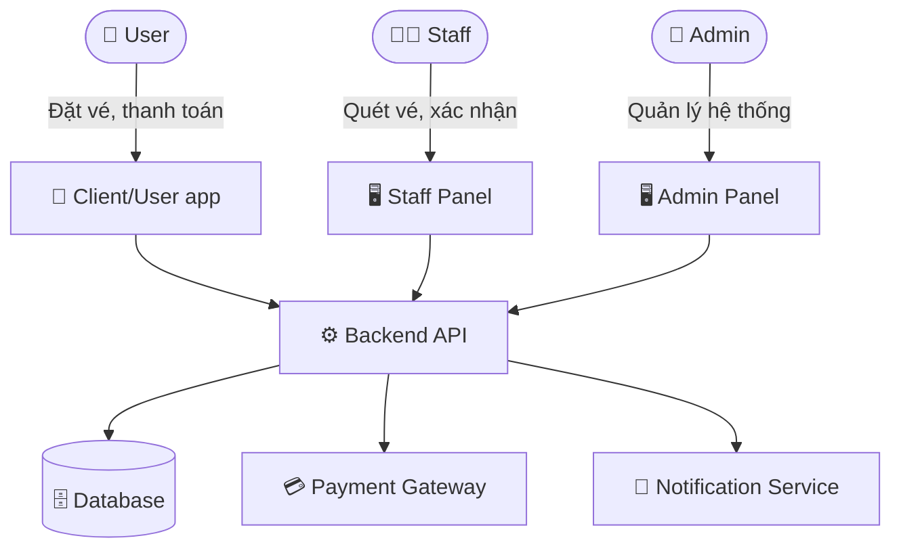

## 2.2 Các Actor

| Actor | Mô tả | Kênh tương tác |
| --- | --- | --- |
| User | Người dùng cuối, tìm phim và mua vé | Client/User app |
| Staff | Nhân viên rạp, xác nhận vé và hỗ trợ | Staff Panel / App |
| Admin | Quản trị toàn bộ hệ thống, nội dung, báo cáo | Admin Web Panel |

# 3. Yêu cầu chức năng

## 3.1 Actor: USER

### 3.1.1 Đăng ký / Đăng nhập

- UC-U01 – Đăng ký tài khoản bằng email hoặc số điện thoại (xác thực OTP).

- UC-U02 – Đăng nhập bằng email/mật khẩu hoặc OAuth (Google).

- UC-U03 – Quên mật khẩu, khôi phục qua email.

- UC-U04 – Đăng xuất khỏi tài khoản.

### 3.1.2 Tìm kiếm & Xem phim

- UC-U05 – Xem danh sách phim đang chiếu, sắp chiếu.

- UC-U06 – Tìm kiếm phim theo tên, thể loại, diễn viên.

- UC-U07 – Xem chi tiết phim: trailer, mô tả, thể loại, thời lượng, đánh giá.

- UC-U08 – Xem danh sách rạp chiếu gần vị trí hiện tại (GPS).

- UC-U09 – Lọc suất chiếu theo ngày, giờ, rạp.

### 3.1.3 Đặt vé & Chọn ghế

- UC-U10 – Chọn suất chiếu (ngày, giờ, phòng chiếu).

- UC-U11 – Xem sơ đồ ghế theo thời gian thực; phân biệt ghế trống / đã đặt / đang giữ.

- UC-U12 – Chọn tối đa 8 ghế/lần đặt.

- UC-U13 – Giữ ghế trong 10 phút khi chưa thanh toán; tự động hủy nếu hết thời gian.

- UC-U14 – Chọn Combo bắp/nước kết hợp khi đặt vé; xem mô tả, hình ảnh, giá niêm yết của từng combo trước khi thêm vào giỏ.

- UC-U14b – Nếu phim có nhãn T18, hệ thống hiển thị hộp thoại xác nhận tuổi ("Tôi xác nhận đủ 18 tuổi") trước khi cho phép tiếp tục mua vé.

### 3.1.4 Thanh toán

- UC-U15 – Thanh toán đặt vé qua VNPay (chuyển khoản ngân hàng, thẻ ATM nội địa, thẻ Visa/Master).

- UC-U16 – Nhận xác nhận thanh toán thành công và vé điện tử (mã QR) qua app & email.

- UC-U17 – Hủy vé đã đặt (trong thời gian cho phép) và nhận hoàn tiền theo chính sách.

- UC-U18 – Xem trạng thái giao dịch VNPay (thành công / thất bại / đang xử lý).

### 3.1.5 Quản lý vé & Lịch sử

- UC-U19 – Xem danh sách vé đã đặt (sắp chiếu, đã xem, đã hủy).

- UC-U20 – Hiển thị mã QR vé để nhân viên quét tại cổng.

- UC-U21 – Hủy vé (trong thời gian cho phép).

- UC-U22 – Xem lịch sử giao dịch và tải hóa đơn.

### 3.1.6 Đánh giá & Thông báo

- UC-U23 – Đánh giá & nhận xét phim; chỉ user đã có Booking PAID cho phim đó mới được gửi đánh giá (Verified Review – chống spam). Mỗi booking chỉ được review 1 lần.

- UC-U24 – Nhận thông báo push theo các sự kiện: (1) Thanh toán thành công – gửi ngay; (2) Nhắc lịch chiếu – gửi trước 30 phút; (3) Phim yêu thích có suất chiếu mới; (4) Voucher mới được cấp; (5) Booking hủy / hoàn tiền thành công.

- UC-U25 – Quản lý tùy chọn thông báo trong cài đặt.

### 3.1.7 Hồ sơ cá nhân

- UC-U26 – Cập nhật thông tin cá nhân, ảnh đại diện.

- UC-U27 – Xem lịch sử vé đã đặt.

## 3.2 Actor: STAFF

### 3.2.1 Xác thực vé

- UC-S01 – Đăng nhập vào hệ thống Staff bằng tài khoản nội bộ.

- UC-S02 – Quét mã QR vé của khách tại cổng vào rạp.

- UC-S03 – Hiển thị kết quả xác thực: hợp lệ / đã sử dụng / sai suất chiếu.

- UC-S04 – Tra cứu vé thủ công bằng mã vé khi không quét được QR.

### 3.2.2 Hỗ trợ khách hàng tại quầy

- UC-S05 – Xem thông tin đặt vé của khách theo tên hoặc số điện thoại.

- UC-S06 – Hỗ trợ đổi / hủy vé theo chính sách.

- UC-S07 – In vé giấy hoặc gửi lại vé qua email cho khách.

### 3.2.3 Quản lý suất chiếu (Staff được phân quyền)

- UC-S08 – Cập nhật trạng thái phòng chiếu (sẵn sàng / bảo trì).

- UC-S09 – Báo cáo sự cố kỹ thuật phòng chiếu lên Admin.

- UC-S10 – Xem danh sách đặt vé theo suất chiếu để chuẩn bị.

## 3.3 Actor: ADMIN

### 3.3.1 Quản lý nội dung

- UC-A01 – Thêm / sửa / xóa thông tin phim; bắt buộc chọn nhãn phân loại độ tuổi: P / K / T13 / T16 / T18 (theo Thông tư 05/2023/TT-BVHTTDL).

- UC-A17 – Quản lý Combo đồ ăn/thức uống: thêm mới, sửa thông tin & giá, xóa, kích hoạt/ẩn combo theo mùa vụ.

- UC-A02 – Quản lý danh mục thể loại phim.

- UC-A03 – Quản lý danh sách rạp chiếu và phòng chiếu (sức chứa, loại ghế, công nghệ chiếu: 2D/3D/IMAX).

- UC-A04 – Tạo và quản lý lịch chiếu (suất chiếu): gán phim – phòng – thời gian.

### 3.3.2 Quản lý tài khoản

- UC-A05 – Xem, tìm kiếm danh sách tài khoản User.

- UC-A06 – Kích hoạt / vô hiệu hóa / xóa tài khoản User.

- UC-A07 – Tạo, phân quyền và quản lý tài khoản Staff.

- UC-A08 – Phân quyền chi tiết theo vai trò (RBAC).

### 3.3.3 Quản lý đặt vé & Tài chính

- UC-A09 – Xem danh sách tất cả booking, lọc theo trạng thái / ngày / rạp.

- UC-A10 – Hủy booking và xử lý hoàn tiền qua VNPay Refund API.

- UC-A11 – Xem thống kê số vé đã bán theo phim / suất chiếu.

- UC-A12 – Xem báo cáo doanh thu: theo ngày / tuần / tháng / phim / rạp.

- UC-A13 – Xuất báo cáo doanh thu dưới định dạng Excel (.xlsx) và PDF.

- UC-A18 – Dashboard tổng quan: vé bán hôm nay, doanh thu hôm nay, Top 5 phim bán chạy, Top 5 suất chiếu đông khách, tỷ lệ lấp đầy ghế trung bình. Dữ liệu tự làm mới mỗi 5 phút.

### 3.3.4 Cấu hình hệ thống

- UC-A14 – Cấu hình giá vé theo loại ghế và suất chiếu.

- UC-A15 – Quản lý banner / thông báo hiển thị trên app.

- UC-A16 – Cấu hình thông tin tích hợp VNPay (Terminal ID, Secret Key, môi trường sandbox/production).

# 4. Luồng hoạt động chính (Main Flows)

## 4.1 Luồng đặt vé (Happy Path)

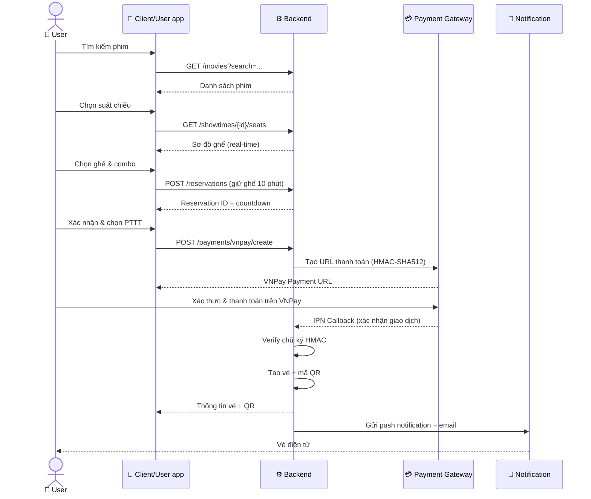

## 4.2 Luồng xác thực vé tại rạp

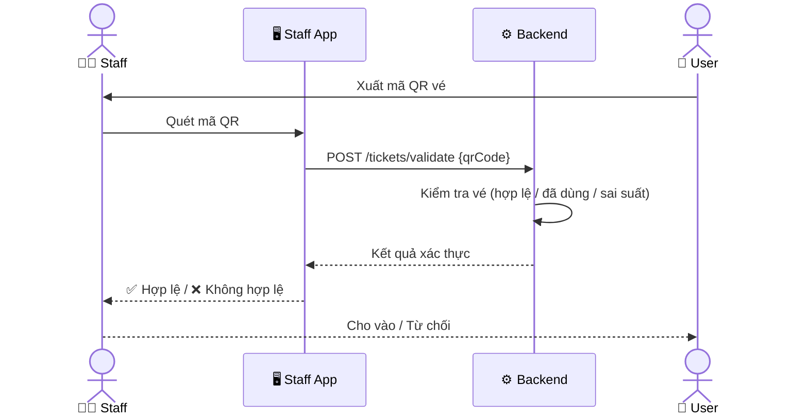

## 4.3 Luồng hủy vé

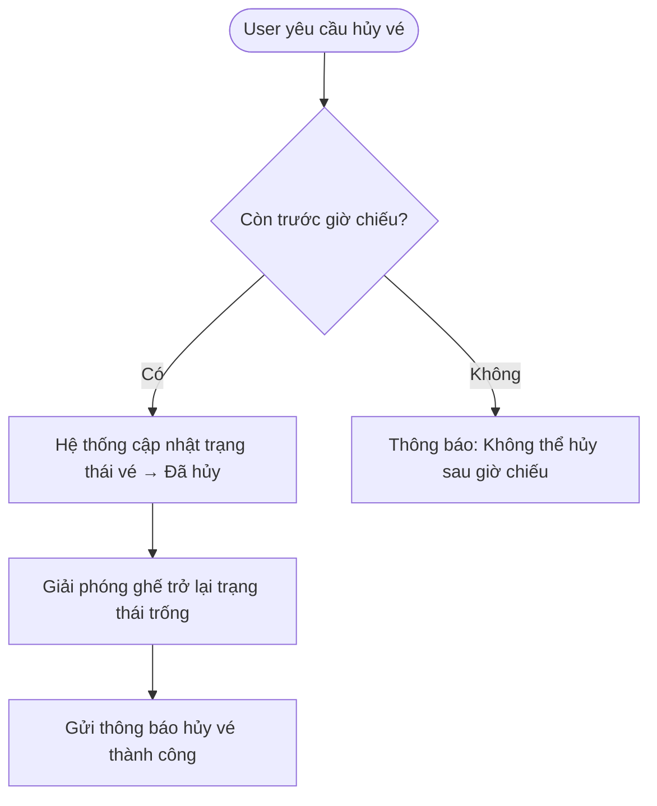

# 5. Yêu cầu phi chức năng

## 5.1 Hiệu năng

- Thời gian phản hồi API ≤ 500ms cho 95% request trong điều kiện bình thường.

- Hệ thống xử lý đồng thời tối thiểu 1.000 người dùng đặt vé cùng lúc.

- Cập nhật trạng thái ghế theo thời gian thực (WebSocket hoặc SSE) với độ trễ < 2 giây.

## 5.2 Bảo mật

- Xác thực bằng JWT (access token + refresh token).

- Mã hóa mật khẩu bằng bcrypt.

- Mã QR vé có thời hạn hiệu lực để tránh dùng lại.

- Phân quyền theo vai trò: User / Staff / Admin.

- Giao tiếp với VNPay sử dụng HMAC-SHA512 để xác thực chữ ký giao dịch.

- Toàn bộ API gọi đến VNPay qua HTTPS; không lưu thông tin thẻ trực tiếp.

## 5.3 Khả dụng & Độ tin cậy

- SLA uptime: ≥ 99.5%.

- Sao lưu database tự động mỗi 24 giờ; lưu trữ tối thiểu 30 ngày.

- Hệ thống có cơ chế failover tự động khi một node gặp sự cố.

## 5.4 Phạm vi dự án

- Hệ thống xây dựng theo mô hình monolithic, phù hợp quy mô dự án.

- Hỗ trợ 1 rạp chiếu với nhiều phòng và suất chiếu.

- Tích hợp cổng thanh toán VNPay (sandbox cho môi trường dev, production khi triển khai thật).

## 5.5 Khả năng sử dụng (UX)

- Luồng đặt vé hoàn thành trong ≤ 5 bước từ màn hình chọn phim.

- Hỗ trợ Dark Mode và cỡ chữ có thể điều chỉnh.

- Client/User app dành cho User (chỉ mô tả luồng nghiệp vụ; không yêu cầu setup mobile app).

- Thời gian tải màn hình chính ≤ 3 giây trên mạng 4G.

## 5.6 Bản địa hóa

- Hỗ trợ ngôn ngữ: Tiếng Việt (mặc định), Tiếng Anh.

- Đơn vị tiền tệ: VNĐ.

# 6. Mô hình dữ liệu (Entity Overview & ERD – Cập nhật)

## 6.1 Danh sách Entity & Thuộc tính

| Entity | Thuộc tính chính | Ghi chú thay đổi |
| --- | --- | --- |
| Users | id, full_name, email, phone, password_hash, avatar, member_rank, loyalty_points, created_at, updated_at | Không thay đổi |
| Genres ✨ | id, name | Bổ sung mới (điểm 9) – quản lý thể loại phim chuẩn hóa |
| MovieGenres ✨ | movie_id (FK), genre_id (FK) · UNIQUE(movie_id, genre_id) | Bổ sung mới (điểm 9) – quan hệ n-n giữa Movies và Genres |
| Movies | id, title, description, duration, director, cast_list, poster, trailer_url, age_rating ENUM(P/K/T13/T16/T18) NOT NULL, release_date, status, created_at, updated_at | Cập nhật (điểm 9 + BR-AGE-RATING): bỏ genre[] → bảng MovieGenres; thêm age_rating bắt buộc |
| Cinemas ✨ | id, name, address, city, latitude, longitude, phone, status, created_at | Bổ sung mới (điểm 1) – quản lý rạp/chi nhánh. Quan hệ: Cinemas 1-n Rooms |
| Rooms | id, cinema_id (FK), name, capacity, screen_type (2D/3D/IMAX/4DX), status (ACTIVE/INACTIVE/MAINTENANCE) | Cập nhật (điểm 1, 11): gắn FK cinema_id; chuẩn hóa screen_type |
| Seats | id, room_id (FK), row_label, seat_number, seat_code, seat_type (NORMAL/VIP/COUPLE/DISABLED), status (ACTIVE/BROKEN/INACTIVE) · UNIQUE(room_id, row_label, seat_number) hoặc UNIQUE(room_id, seat_code) | Cập nhật (điểm 11): chuẩn hóa cột, thêm seat_code, seat_type, status |
| Showtimes | id, movie_id (FK), room_id (FK), start_time, end_time, base_price, format (2D/3D/IMAX/4DX), language, subtitle, status (OPEN/CLOSED/CANCELLED/FINISHED), created_at · RULE: không cho phép 2 suất chiếu trùng thời gian trong cùng phòng | Cập nhật (điểm 10): bổ sung format, language, subtitle, status chuẩn; thêm ràng buộc kiểm tra trùng lịch |
| ShowtimeSeats ✨ | id, showtime_id (FK), seat_id (FK), price, status (AVAILABLE/HELD/BOOKED/BLOCKED), hold_expires_at, held_by_user_id (FK, nullable) · UNIQUE(showtime_id, seat_id) | Bổ sung mới (điểm 2) – quản lý trạng thái ghế theo từng suất chiếu. Đây là bảng cốt lõi fix lỗi ERD cũ |
| Bookings | id, user_id (FK), showtime_id (FK), booking_code (UNIQUE), status (PENDING/PAID/CANCELLED/EXPIRED/REFUNDED), total_seat_price, total_food_price, discount_amount, final_amount, expires_at, paid_at, cancelled_at, created_at, updated_at | Cập nhật (điểm 3): chuẩn hóa trạng thái, tách tiền ghế/đồ ăn/discount; gắn trực tiếp với Showtimes |
| BookingSeats | id, booking_id (FK), showtime_seat_id (FK) | Cập nhật (điểm 2): đổi FK từ seat_id sang showtime_seat_id. Flow: Seats → ShowtimeSeats → BookingSeats → Bookings |
| Tickets | id, booking_id (FK), showtime_seat_id (FK), qr_code (UNIQUE), is_used, used_at | Cập nhật tương ứng: dùng showtime_seat_id thay seat_id |
| Payments | id, booking_id (FK), amount, method (vnpay/momo/...), provider, provider_transaction_id, status (PENDING/SUCCESS/FAILED/CANCELLED/REFUNDED), paid_at, failed_reason, raw_response, created_at | Cập nhật (điểm 4): quan hệ Bookings 1-n Payments (nhiều lần thử thanh toán) |
| FoodItems (Combos) | id, name, description, image_url, base_price, category (COMBO/FOOD/DRINK), is_available, sort_order, created_at, updated_at | Cập nhật (UC-A17): CRUD combo đầy đủ; thêm category, sort_order; is_available cho ẩn/hiện theo mùa vụ |
| BookingFoods | id, booking_id (FK), food_item_id (FK), name (snapshot), quantity, unit_price (snapshot), total_price | Cập nhật (điểm 5): lưu snapshot name & unit_price tại thời điểm đặt – bảo toàn lịch sử dù giá thay đổi sau này |
| Vouchers | id, code, description, discount_type (PERCENT/FIXED), discount_value, min_order_value, max_discount_amount, start_date, end_date, usage_limit, used_count, status, created_at | Không thay đổi lớn |
| UserVouchers | id, user_id (FK), voucher_id (FK), status (AVAILABLE/USED/EXPIRED), assigned_at, used_at | Cập nhật (điểm 6): bổ sung trường status |
| BookingDiscounts ✨ | id, booking_id (FK), voucher_id (FK), user_voucher_id (FK), discount_amount, applied_at | Bổ sung mới (điểm 6) – lưu voucher đã áp dụng cho booking. Quan hệ: Bookings 1-n BookingDiscounts |
| Reviews | id, user_id (FK), movie_id (FK), booking_id (FK), rating (1–5), comment, status (PENDING/APPROVED/REJECTED), created_at, updated_at · RULE: chỉ user có booking PAID cho movie đó mới được review | Cập nhật (điểm 7): gắn thêm booking_id để xác thực người đã xem phim mới được đánh giá |
| LoyaltyTransactions | id, user_id (FK), booking_id (FK, nullable), type (EARN/REDEEM/ADJUST/EXPIRE), points, description, created_at | Cập nhật (điểm 8): gắn thêm booking_id để biết điểm được cộng/trừ từ giao dịch nào |
| Notifications ✨ | id, user_id (FK), title, content, type (BOOKING/PAYMENT/VOUCHER/SYSTEM), is_read, created_at | Bổ sung mới (điểm 12) – thông báo đặt vé, thanh toán, voucher, hệ thống |
| Staff | id, full_name, email, cinema_id (FK), role, status, created_at | Không thay đổi |

## 6.2 Tóm tắt quan hệ chính (ERD Relationships)

| Quan hệ | Cardinality | Ghi chú |
| --- | --- | --- |
| Cinemas → Rooms | 1 : n | Một rạp có nhiều phòng chiếu |
| Rooms → Seats | 1 : n | Một phòng có nhiều ghế vật lý |
| Movies ↔ Genres (qua MovieGenres) | n : n | Một phim thuộc nhiều thể loại |
| Showtimes → ShowtimeSeats | 1 : n | Mỗi suất chiếu sinh ra bản ghi trạng thái ghế riêng |
| Seats → ShowtimeSeats | 1 : n | Một ghế vật lý có trạng thái khác nhau ở mỗi suất |
| ShowtimeSeats → BookingSeats | 1 : 1 | Một slot ghế-suất chỉ được đặt một lần |
| Bookings → BookingSeats | 1 : n | Một booking gồm nhiều ghế |
| Bookings → Payments | 1 : n | Cho phép nhiều lần thử thanh toán |
| Bookings → BookingFoods | 1 : n | Đồ ăn kèm booking, lưu snapshot giá |
| Bookings → BookingDiscounts | 1 : n | Voucher áp dụng cho booking |
| Vouchers → UserVouchers | 1 : n | Phân phát voucher cho user |
| Bookings → Reviews | 1 : 1 | Mỗi booking được review tối đa 1 lần, xác thực đã xem |
| Bookings → LoyaltyTransactions | 1 : n | Giao dịch điểm thưởng gắn với booking |
| Users → Notifications | 1 : n | Thông báo cá nhân hóa theo user |

## 6.3 Luồng dữ liệu chuẩn (Booking Data Flow)

Flow đặt ghế đúng sau khi bổ sung ShowtimeSeats:

User chọn phim → chọn Cinemas → chọn Showtimes → chọn ShowtimeSeats (status: AVAILABLE) → giữ ghế tạm (status: HELD, hold_expires_at = +10 phút, held_by_user_id = user) → tạo Booking (status: PENDING) → tạo BookingSeats → chọn FoodItems → áp dụng Voucher → ghi BookingDiscounts → gọi Payment → Payment SUCCESS → Booking.status = PAID → ShowtimeSeats.status = BOOKED → sinh Ticket + QR code → gửi Notification + cộng LoyaltyPoints

## 6.4 Ràng buộc Unique & Business Rules bổ sung

- ShowtimeSeats: UNIQUE(showtime_id, seat_id) – mỗi ghế chỉ xuất hiện 1 lần trong 1 suất chiếu.

- Seats: UNIQUE(room_id, row_label, seat_number) hoặc UNIQUE(room_id, seat_code).

- MovieGenres: UNIQUE(movie_id, genre_id).

- Showtimes: Kiểm tra tại tầng application (hoặc trigger DB) rằng không có 2 suất chiếu nào cùng room_id bị trùng khoảng [start_time, end_time].

- Reviews: Chỉ tạo được khi Booking.status = PAID và booking.showtime.movie_id = review.movie_id.

- BookingFoods: Trường unit_price và name là snapshot tại thời điểm đặt, không nối join sang FoodItems.base_price để tính lại.

- Payments: Một Booking có thể có nhiều Payment; chỉ 1 Payment trạng thái SUCCESS là hợp lệ.

- Ghế hết hạn giữ: Job định kỳ (scheduler) chạy mỗi 1 phút kiểm tra ShowtimeSeats có status = HELD và hold_expires_at < NOW() → đặt lại status = AVAILABLE, xóa held_by_user_id, cập nhật Booking.status = EXPIRED.

- [BR-SEAT-LOCK] Race condition: POST /hold-seats phải chạy trong transaction với SELECT FOR UPDATE hoặc Optimistic Lock (UPDATE WHERE status='AVAILABLE' + check rowsAffected). Kết quả 409 nếu ghế đã bị giữ bởi người khác.

- [BR-AGE-RATING]: age_rating ENUM('P','K','T13','T16','T18') NOT NULL DEFAULT 'P'. Phim T18 → client gửi age_confirmed: true khi POST /bookings.

- [BR-COMBO]: FoodItems.is_available = false → ẩn khỏi API public; chỉ Admin thấy trong CMS. sort_order cho phép Admin sắp xếp hiển thị combo trên App.

# 7. Ràng buộc & Giả định

- Mỗi User chỉ được đặt tối đa 8 ghế cho một suất chiếu.

- Ghế được giữ 10 phút sau khi chọn; nếu chưa thanh toán sẽ tự động hủy.

- Chính sách hủy vé: hoàn 100% nếu hủy trước 2 tiếng; hoàn 50% nếu hủy trong vòng 2 tiếng trước giờ chiếu; không hoàn sau giờ chiếu.

- Hoàn tiền thực hiện qua VNPay Refund API; thời gian phản ánh vào tài khoản theo ngân hàng (1–3 ngày làm việc).

- Mã QR vé có hiệu lực từ 2 giờ trước suất chiếu đến 30 phút sau giờ chiếu.

- Hệ thống tích hợp VNPay theo tài liệu VNPay Payment Gateway v2.1.0.

- [BR-SEAT-LOCK] Chống đặt trùng ghế: Một ghế chỉ được đặt bởi một người tại cùng thời điểm trong cùng suất chiếu. API POST /hold-seats phải chạy trong một database transaction sử dụng SELECT ... FOR UPDATE (Pessimistic Lock) hoặc UPDATE ... WHERE status='AVAILABLE' + kiểm tra rowsAffected (Optimistic Lock). Nếu rowsAffected = 0 → trả 409 Conflict. Tuyệt đối không dùng check-then-act ngoài transaction.

- [BR-AGE-RATING] Phân loại độ tuổi: Movies.age_rating ENUM('P','K','T13','T16','T18') NOT NULL. Phim nhãn T18: App hiển thị hộp thoại xác nhận tuổi bắt buộc; API POST /bookings yêu cầu age_confirmed: true, thiếu → 422 Unprocessable Entity.

# 8. Phụ lục – Danh sách Use Case tổng hợp

| Mã UC | Tên Use Case | Actor | Độ ưu tiên |
| --- | --- | --- | --- |
| UC-U01~U04 | Xác thực tài khoản | User | Cao |
| UC-U05~U09 | Tìm kiếm phim & suất chiếu | User | Cao |
| UC-U10~U14 | Chọn ghế & giữ chỗ | User | Cao |
| UC-U15~U18 | Thanh toán VNPay & hủy vé | User | Cao |
| UC-U19~U22 | Quản lý vé | User | Cao |
| UC-U23~U25 | Đánh giá & Thông báo | User | Trung bình |
| UC-U26~U27 | Hồ sơ cá nhân | User | Trung bình |
| UC-S01~S04 | Xác thực vé tại cổng | Staff | Cao |
| UC-S05~S07 | Hỗ trợ khách tại quầy | Staff | Cao |
| UC-S08~S10 | Quản lý phòng chiếu | Staff | Trung bình |
| UC-A01~A04 | Quản lý nội dung | Admin | Cao |
| UC-A05~A08 | Quản lý tài khoản | Admin | Cao |
| UC-A09~A13 | Quản lý đặt vé, doanh thu & xuất báo cáo | Admin | Cao |
| UC-A14~A16 | Cấu hình hệ thống & VNPay | Admin | Trung bình |
| UC-A17 | Quản lý Combo đồ ăn/thức uống (CRUD, giá, ẩn/hiện) | Admin | Cao |
| UC-A18 | Dashboard tổng quan Admin (vé bán, doanh thu, top phim, tỷ lệ lấp đầy) | Admin | Cao |

# 9. Luồng hoạt động chi tiết (Detailed Flows)

Phần này mô tả đầy đủ các luồng nghiệp vụ của hệ thống, bao gồm cả luồng xác thực tài khoản.

## 9.1 Luồng xác thực tài khoản

### 9.1.1 Đăng nhập bằng Google (Google OAuth 2.0)

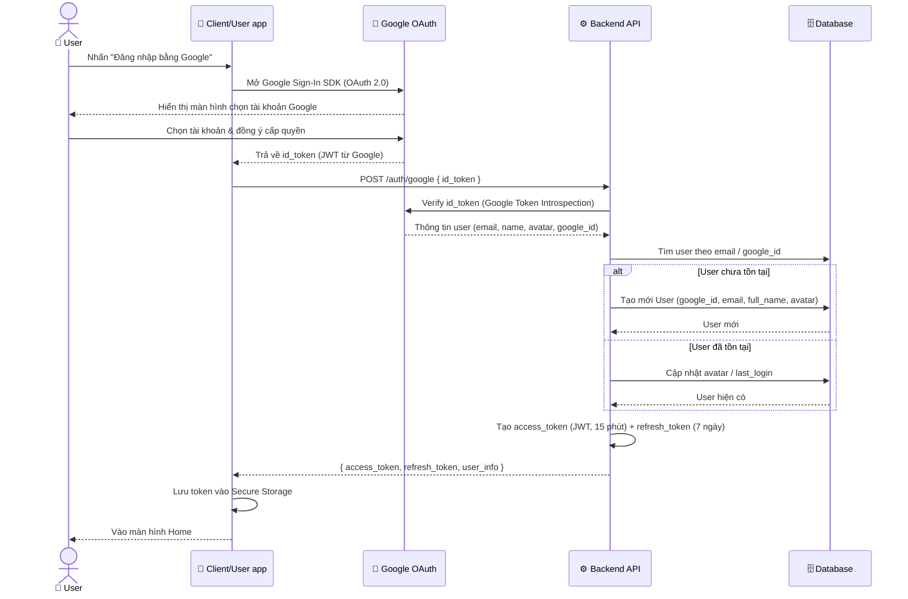

### 9.1.2 Quên mật khẩu – Yêu cầu reset

Lưu ý: Hệ thống chỉ hỗ trợ khôi phục qua Email. Không sử dụng OTP qua email.

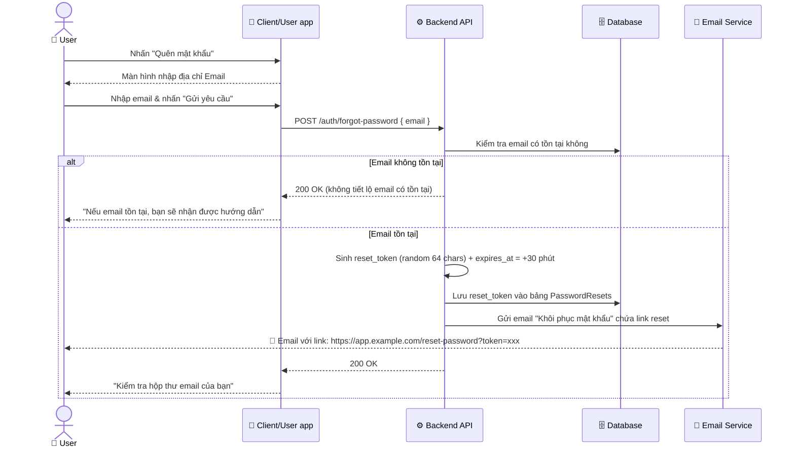

### 9.1.3 Khôi phục mật khẩu – Đặt mật khẩu mới qua Email

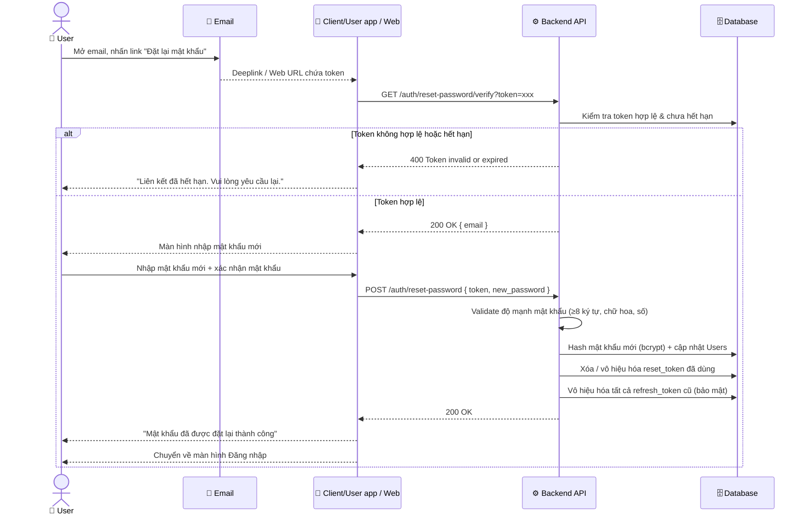

### 9.1.4 Refresh Token – Gia hạn phiên đăng nhập

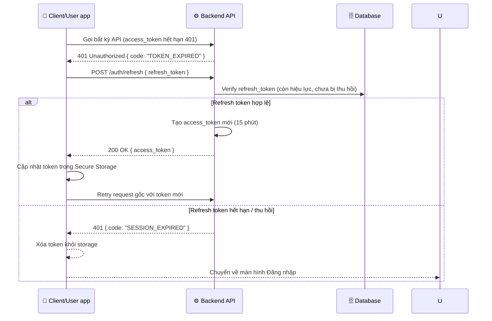

### 9.1.5 Đăng xuất

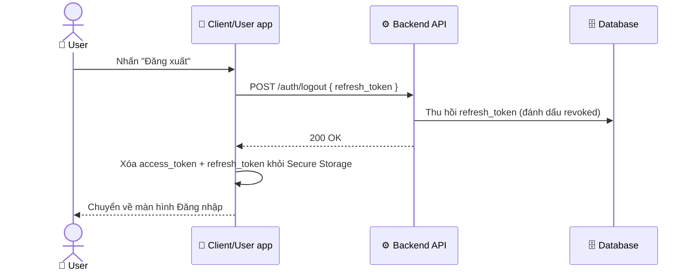

## 9.2 Luồng đặt vé chi tiết (Full Booking Flow)

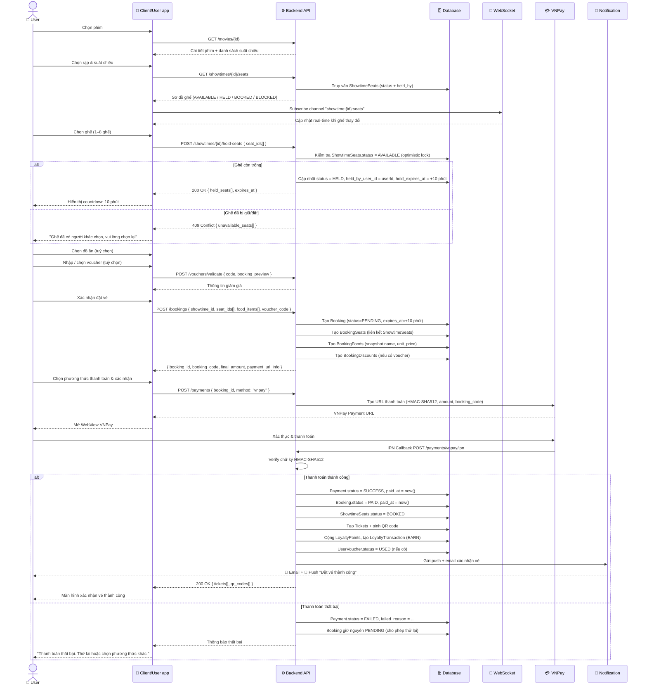

## 9.3 Luồng hủy vé & hoàn tiền

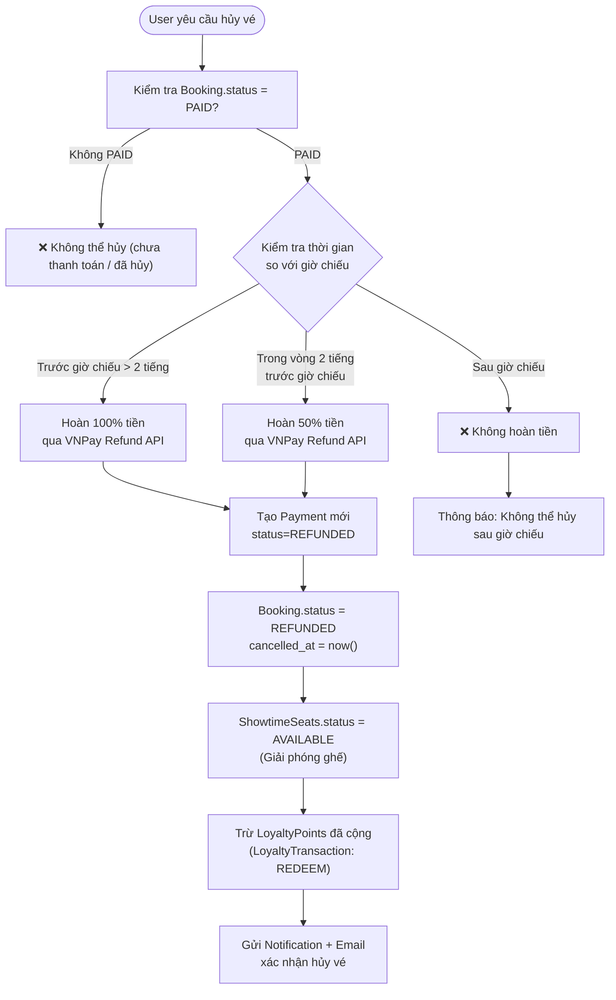

## 9.4 Luồng tự động giải phóng ghế hết hạn giữ (Scheduler)

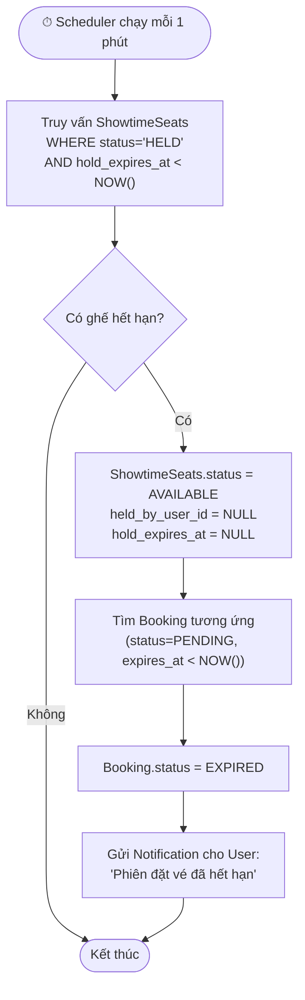

## 9.5 Luồng xác thực vé tại rạp (Staff Scan QR)

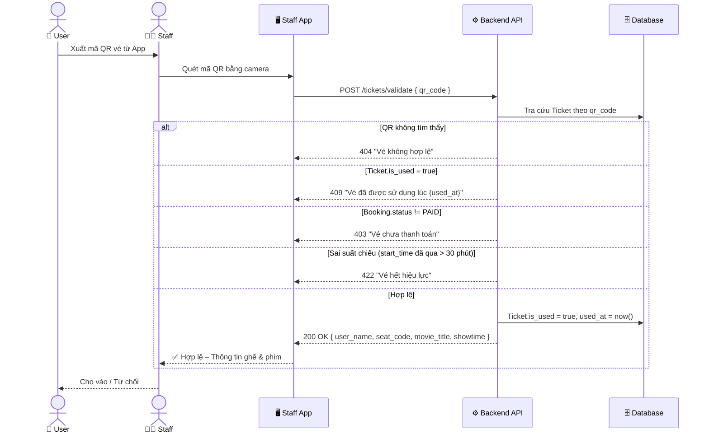

## 9.6 Luồng đánh giá phim (Verified Review)

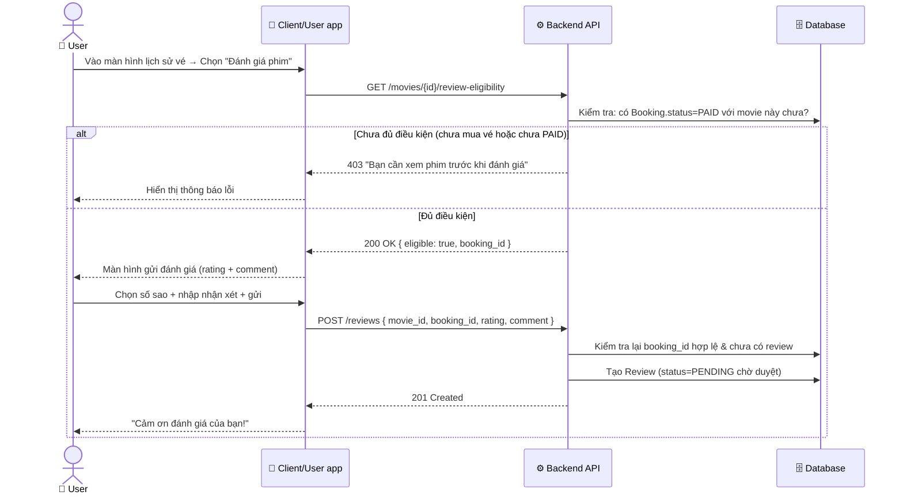

## 9.7 Luồng áp dụng Voucher

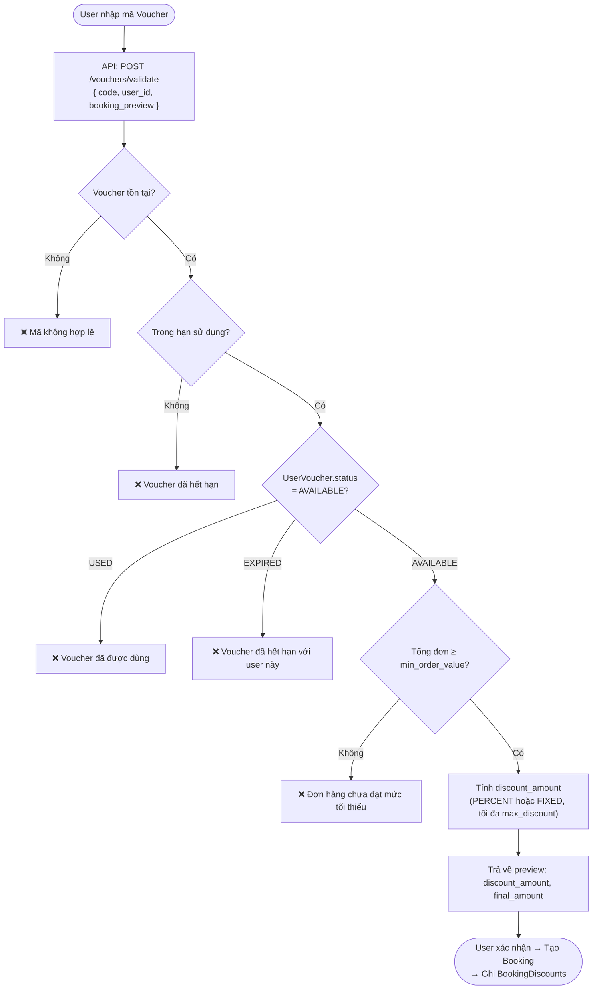

## 9.8 Luồng gửi thông báo (Notifications)

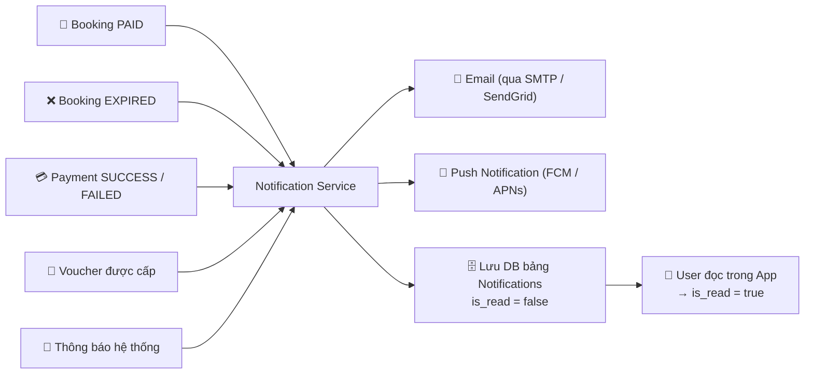
